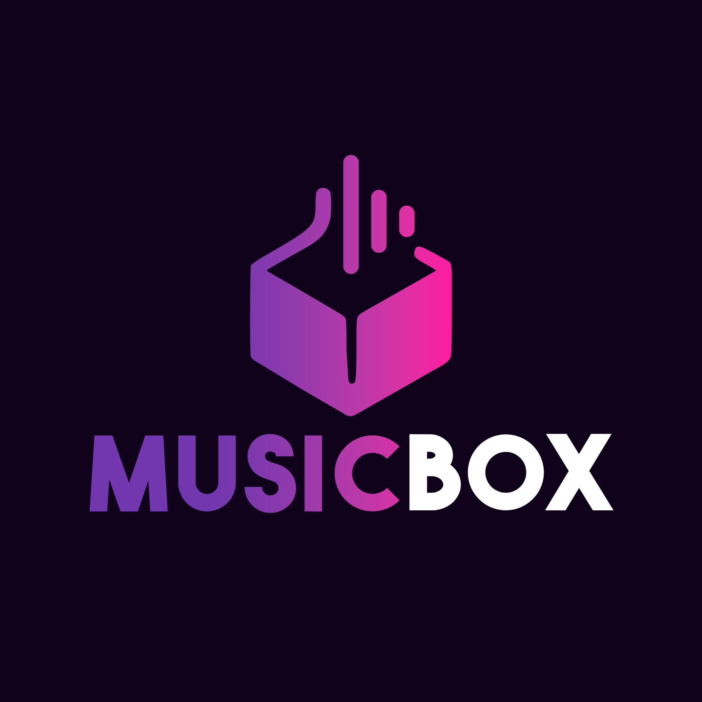
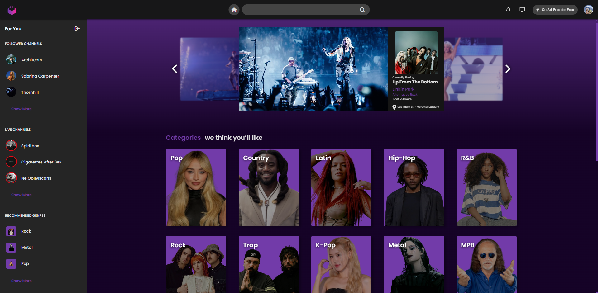
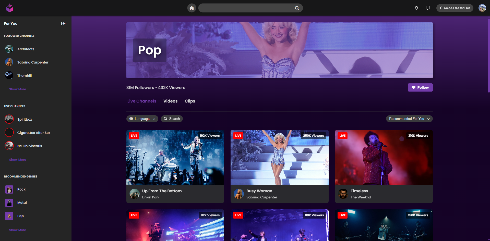
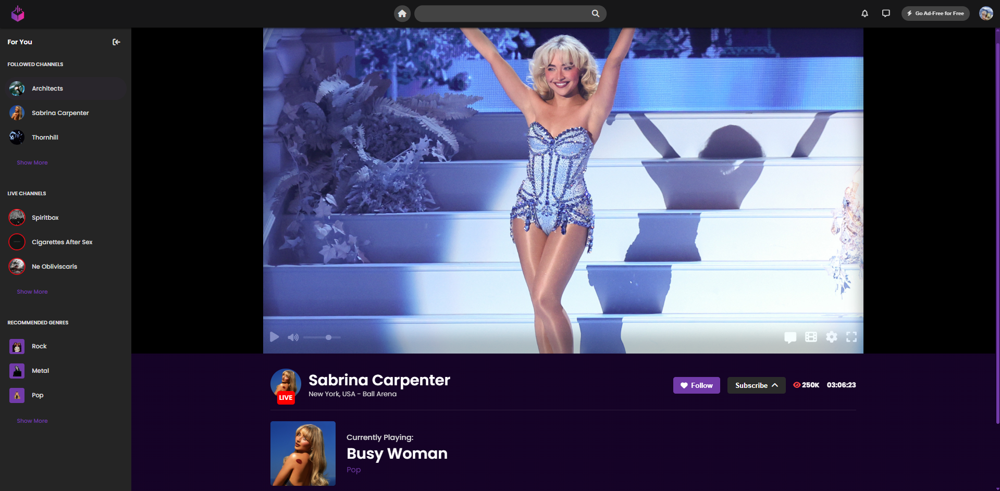
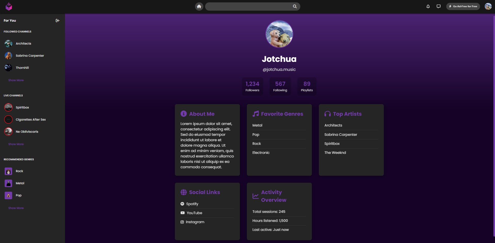
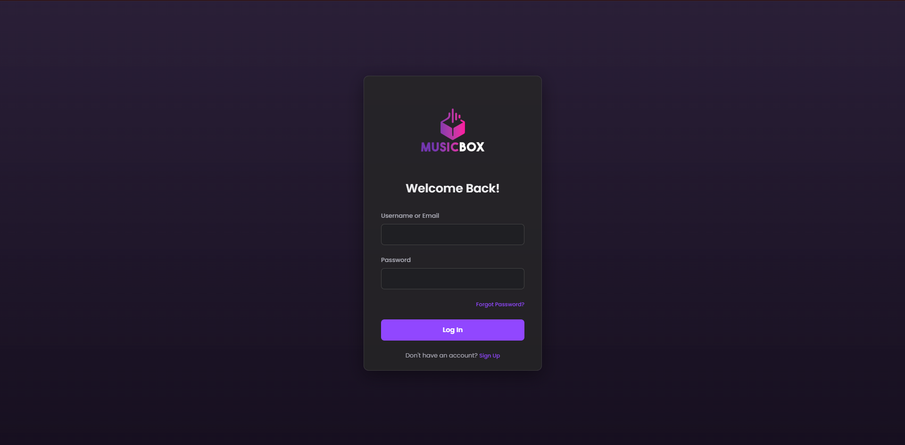
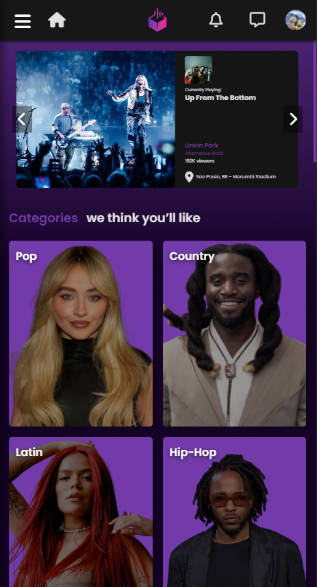
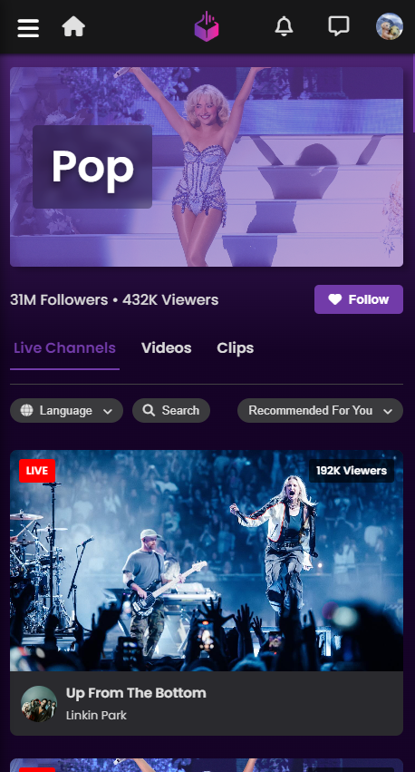

# MusicBox

  


**MusicBox** é uma plataforma web interativa e imersiva que nasceu de uma ideia intrigante: "E se a Twitch, a gigante do streaming, focasse em shows e experiências musicais ao vivo?". Nosso projeto simula um ambiente dinâmico de streaming de música, conectando usuários a artistas e gêneros musicais de uma forma nova e empolgante. Com uma interface intuitiva e design responsivo, MusicBox oferece uma experiência rica, seja em um desktop widescreen ou na palma da sua mão.

## ✨ Visão Geral e Propósito

A plataforma foi projetada para proporcionar:

* **Descoberta Musical:** Facilidade para explorar novos artistas e gêneros através de categorias bem definidas e recomendações personalizadas.
* **Experiência de Show Ao Vivo:** Um player de vídeo robusto que simula a emoção de uma performance ao vivo, com funcionalidades interativas como chat em tempo real.
* **Personalização:** Perfis de usuário que permitem acompanhar artistas favoritos, gerenciar playlists e visualizar atividades.
* **Acessibilidade:** Um design que se adapta perfeitamente a diferentes tamanhos de tela, garantindo uma ótima experiência tanto em computadores quanto em dispositivos móveis.

## 👥 Integrantes do Projeto

Este projeto foi desenvolvido por:

* **Daniel Alexandre Pereira de Abreu**
* **Gabriel da Costa Vangasse**
* **Ivo Lucas Araújo Viveiros de Lima**
* **Jordana Gabriela Ferreira Costa**
* **José Gabriel Bonfim Severo Amorim**

## 🚀 Funcionalidades Destacadas

### 🏡 Página Inicial (`home.html`)

A porta de entrada para o mundo MusicBox!
* **Carrossel de Destaque**: Um banner interativo que apresenta shows e streams em evidência, com detalhes sobre o artista, a música, o número de espectadores e a localização do evento.
* **Navegação por Categorias**: Explore uma vasta gama de gêneros musicais organizados em seções temáticas como "Categories we think you’ll like", "Popular Sessions" e "For Chilling", facilitando a descoberta de novos sons.

  

### 🎶 Página de Categoria (`category.html`)

* **Banner Dinâmico**: Cada categoria é apresentada com um banner exclusivo e informações relevantes, como o número de seguidores e espectadores.
* **Filtros Inteligentes**: Refine sua busca com opções de filtro por idioma e ordenação (recomendados, mais visualizados, recém-iniciados).
* **Abas de Conteúdo**: Alterne facilmente entre "Live Channels" (canais ao vivo), "Videos" (vídeos gravados) e "Clips" (trechos curtos).
* **Grade de Vídeos**: Uma exibição organizada de todos os vídeos e canais disponíveis na categoria selecionada.
  
  

### 📺 Página de Vídeo (`video-page.html`)

* **Player de Vídeo Interativo**: Desfrute de uma experiência de visualização fluida com controles de reprodução (play/pause, volume) e modo tela cheia.
* **Informações Completas do Stream**: Tenha acesso rápido aos detalhes do canal/artista (ícone, nome, localização) e às estatísticas de visualizações em tempo real.
* **Detalhes da Música**: Veja o título e o gênero da música que está sendo reproduzida no momento.
* **Painel de Chat Dinâmico**: Participe da comunidade com um chat lateral interativo, simulando a comunicação em tempo real.
* **Ações do Usuário**: Botões intuitivos para "Follow" (Seguir) e "Subscribe" (Inscrever-se), com um dropdown para explorar diferentes níveis de assinatura.
 
  

### 👤 Página de Perfil (`profile.html`)

* **Informações Personalizadas**: Visualize seu avatar, nome de usuário e estatísticas importantes como número de seguidores, quem você está seguindo e suas playlists.
* **Visão Detalhada**: Seções dedicadas para "About Me" (Sobre Mim), "Favorite Genres" (Gêneros Favoritos), "Top Artists" (Artistas Favoritos), "Social Links" (Links Sociais) e "Activity Overview" (Visão Geral da Atividade).
  
  

### 🔑 Página de Login/Registro (`index.html`)

* **Alternância de Formulários**: Uma interface limpa e intuitiva para alternar entre as opções de Login e Registro.
* **Design Otimizado**: Layout adaptável para garantir uma experiência de usuário consistente em todos os dispositivos.
  
  

### 🌐 Navegação Global

* **Barra Superior Elegante**: Contém o logo do MusicBox, um campo de busca inteligente (para desktop), ícones de notificação e mensagens, um botão "Go Ad-Free" e um dropdown de perfil do usuário para acesso rápido a configurações e logout.
* **Menu Lateral Versátil**: Um menu expansível/retrátil que oferece acesso rápido a seções como canais seguidos, canais ao vivo e gêneros recomendados, com suporte total a navegação mobile (toggle para abrir/fechar).

## 📱 Responsividade Mobile

MusicBox foi desenvolvido com uma filosofia **mobile-first**, garantindo que a experiência do usuário seja fluida e agradável em qualquer dispositivo. Nossas interfaces se adaptam dinamicamente a diferentes tamanhos de tela, desde smartphones compactos até monitores de alta resolução.

* **Layouts Adaptativos**: Elementos se rearranjam e redimensionam para otimizar o espaço disponível.
* **Navegação Otimizada**: Menus e botões são redesenhados para facilitar a interação por toque.
* **Carrossel Flexível**: O carrossel principal ajusta suas proporções e interações para telas menores.
* **Experiência de Vídeo Imersiva**: O player de vídeo e o chat se comportam de forma inteligente no mobile, garantindo uma visualização sem interrupções.

  
  

## 🎨 Design do Projeto

O conceito visual e a prototipagem da MusicBox foram desenvolvidos utilizando as seguintes ferramentas:

* **Protótipo e Fluxo de UI/UX no Figma:** https://www.figma.com/design/7NkoFAFN5jDia3GysZR8le/TWITCH-MUSIC?node-id=10-3&t=cm2JgSimfOOe8kcu-1
* **Protótipo e Fluxo de UI/UX no Figma:** https://www.figma.com/proto/7NkoFAFN5jDia3GysZR8le/TWITCH-MUSIC?node-id=11-2&p=f&t=AWigwjRUAnMQ1vkM-1&scaling=min-zoom&content-scaling=fixed&page-id=10%3A3&starting-point-node-id=11%3A2
## 🛠️ Tecnologias Utilizadas

A construção do MusicBox é solidamente baseada em tecnologias web modernas e ferramentas de design:

* **Desenvolvimento Web:**
    * **HTML5**: A espinha dorsal de nossas páginas, garantindo estrutura semântica e acessível.
    * **CSS3**: Responsável por toda a beleza e adaptabilidade do design, incluindo layout responsivo com Flexbox e Grid, animações e transições suaves.
    * **JavaScript (ES6+)**: O motor interativo do projeto, lidando com a manipulação do DOM, a lógica de funcionalidades complexas como o carrossel e os filtros, o gerenciamento de estados da interface e a simulação de dados dinâmicos.
* **Design e Ativos:**
    * **Adobe Illustrator**: Utilizado para a criação do logotipo vetorial e outros elementos gráficos escaláveis do projeto.
    * **Adobe Photoshop**: Empregado para o tratamento e otimização das imagens, garantindo qualidade visual e bom desempenho.
    * **Font Awesome**: Usado para fornecer ícones vetoriais modernos e escaláveis, melhorando a iconografia da interface.
    * **Google Fonts (Poppins)**: A fonte tipográfica escolhida para garantir uma leitura agradável e uma estética consistente em toda a aplicação.

## ▶️ Como Rodar o Projeto

Para visualizar e interagir com o MusicBox em seu ambiente local, siga estes passos:

1.  **Clone o repositório:**
    Abra seu terminal ou prompt de comando e execute:
    ```bash
    git clone https://github.com/petual1/musicboxprojeto
    ```
2.  **Navegue até o diretório do projeto:**
    ```bash
    cd MusicBox
    ```
3.  **Abra os arquivos HTML no seu navegador:**
    Você pode simplesmente arrastar e soltar os arquivos HTML para a janela do seu navegador, ou navegar até eles e abri-los.

    * Página Inicial: `index.html`
    * Página de Login: `login.html`
    * Página de Categoria: `category.html` (Para testar o carregamento dinâmico, você pode adicionar um parâmetro de gênero na URL, e.g., `category.html?genre=pop`)
    * Página de Perfil: `profile.html`
    * Página de Vídeo: `video-page.html` (Para testar o carregamento dinâmico do vídeo, use um ID, e.g., `video-page.html?id=1`)

    **Recomendado:** Para uma melhor experiência de desenvolvimento, considere usar uma extensão de servidor local (como "Live Server" para VS Code). Isso permite que você veja as alterações em tempo real e simula um ambiente de servidor web.

## 📂 Estrutura de Pastas

A organização do projeto segue uma estrutura clara para facilitar a manutenção e a escalabilidade:

    ├── index.html              # Página inicial da plataforma
    ├── category.html           # Página de listagem de vídeos por categoria
    ├── profile.html            # Página de perfil do usuário
    ├── login.html              # Página de autenticação (login e registro)
    ├── video-page.html         # Página de reprodução de vídeo e chat
    ├── style.css               # Estilos CSS globais da aplicação
    ├── category.css            # Estilos CSS específicos da página de categoria
    ├── profile.css             # Estilos CSS específicos da página de perfil
    ├── login-style.css         # Estilos CSS específicos da página de login/registro
    ├── video-page.css          # Estilos CSS específicos da página de vídeo
    ├── script.js               # Lógica JavaScript principal e do carrossel
    ├── category.js             # Lógica JavaScript da página de categoria
    ├── profile.js              # Lógica JavaScript do dropdown de perfil
    ├── login-script.js         # Lógica JavaScript da página de login/registro
    ├── video-page.js           # Lógica JavaScript da página de vídeo e chat
    └── images/                 # Diretório para todos os recursos de imagem
        ├── logos/              # Logos da MusicBox (incluindo o criado no Illustrator/Photoshop)
        ├── icons/              # Ícones de artistas e outros elementos da UI
        └── mainimgs/           # Imagens principais para banners e thumbnails

## 📜 Licença

© 2025 MusicBox. Todos os direitos reservados.

Este projeto é de propriedade do projeto MusicBox e seus integrantes. Se você tiver interesse em utilizar, modificar ou distribuir este software para quaisquer fins, por favor, entre em contato através do e-mail **danielalexandre1920@gmail.com** para contato.